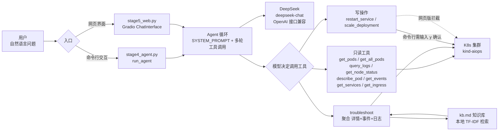

# AI 运维助手（K8s Ops Agent）

基于 **LangChain + DeepSeek** 的 Kubernetes 智能运维助手。用自然语言查询、排查你的 K8s 集群，自动聚合多源数据做根因分析，并内置 RAG 知识库辅助诊断。

📚 更多文档：[技术详解 TECHNICAL.md](docs/TECHNICAL.md)（架构 / 工具设计 / 安全层 / RAG / 踩坑记录）


---

## 功能亮点

- **自然语言运维**：用中文直接问“哪个 Pod 崩溃了？”“为什么起不来？”，Agent 自动调用工具查真实集群数据，而不是凭训练记忆瞎编。
- **11 个运维工具**：覆盖 Pod / 日志 / 事件 / 节点 / 详情 / 服务 / 入口 / 全集群巡检 / 滚动重启 / 扩缩容 / 综合诊断。
- **智能诊断闭环**：`troubleshoot` 自动聚合「详情 + 事件 + 日志」三源数据，输出「①根因分析 → ②修复建议 → ③可选 kubectl 命令」三段式报告。
- **RAG 知识库**：诊断时检索 `kb.md` 中的权威排障片段（纯本地 TF-IDF，离线即可用），让回答有依据而非空谈。
- **安全边界**：写操作（重启 / 扩缩容）在网页版一律拦截，在命令行版必须人工输入 `y` 确认，杜绝误删误改。
- **双形态入口**：命令行交互版 + Gradio 网页版，任选。

---

## 架构



**核心链路**：用户提问 → Agent 循环（SYSTEM_PROMPT 约束行为）→ DeepSeek 决策 → 调用工具获取实时数据 → 结果回喂模型 → 模型给出结论。模型只“提议”调用，真正执行的是代码（安全可控）。

---

## 环境准备

### 1. 本地 K8s 集群（kind）
本项目操作的是你本地的 kind 集群（不需要云上集群）。
```bash
# 安装 Docker Desktop（选 WSL2 后端，Windows 家庭版需开启 hypervisor）
# 安装 kind 与 kubectl 后，创建集群：
kind create cluster --name aiops
# 确认：
kubectl cluster-info --context kind-aiops
```
> 若镜像拉取失败（离线环境），可把镜像在宿主机拉好后用 `kind load docker-image` 导入节点。

### 2. Python 虚拟环境
```bash
cd aiops-agent
python -m venv venv
venv\Scripts\python.exe -m pip install -r requirements.txt
```

### 3. DeepSeek API Key
复制模板并填入你的真实 Key：
```bash
copy .env.example .env
# 编辑 .env：DEEPSEEK_API_KEY=sk-你的真实key
```
> `.env` 已被 `.gitignore` 忽略，不会提交到 GitHub，Key 不会泄露。

### 4. （可选）RAG 知识库
`kb.md` 已内置 10 个排障主题；首次调用诊断时会自动构建本地索引，无需额外操作。

---

## 运行

> **前置检查**（确保以下成立再运行）：
> 1. Docker Desktop 已启动；2. `kind get clusters` 能看到 `aiops`；3. 已 `copy .env.example .env` 并填入 Key。
> 若只想看效果，直接跑**网页版**即可（只读，不会改动你的集群）。

**命令行版**（支持写操作，执行前需输入 `y` 确认）：
```bash
venv\Scripts\python.exe stage4_agent.py
# 进入后可问：诊断 default 下的 crash-demo，它为什么一直崩溃？
```

**网页版**（只读操作直接执行，写操作被拦截）：
```bash
venv\Scripts\python.exe stage5_web.py
# 浏览器打开 http://127.0.0.1:7860
```

---

## 工具清单（11 个）

| 工具 | 类型 | 作用 | 对应 kubectl |
|---|---|---|---|
| `get_pods` | 读 | 查某命名空间 Pod（可按状态筛选，如 `CrashLoopBackOff`） | `get pods` |
| `get_all_pods` | 读 | 全集群所有命名空间 Pod 巡检 | `get pods -A` |
| `query_logs` | 读 | 查 Pod 日志 + 中文故障速查 | `logs` |
| `get_node_status` | 读 | 节点 Ready 状态 | `get nodes` |
| `describe_pod` | 读 | Pod 详情（镜像/命令/节点/IP/重启次数） | `describe pod` |
| `get_events` | 读 | 命名空间事件（排障根因常在此） | `get events` |
| `get_services` | 读 | Service 暴露情况 | `get svc` |
| `get_ingress` | 读 | Ingress 路由规则 | `get ingress` |
| `troubleshoot` | 读 | 聚合三源数据 + RAG 知识库，输出诊断报告 | —（综合） |
| `restart_service` | 写⚠️ | 触发 Deployment 滚动重启 | `rollout restart` |
| `scale_deployment` | 写⚠️ | 调整 Deployment 副本数 | `scale` |

---

## 安全模型

- **写操作白名单**：`DANGEROUS_TOOLS = {restart_service, scale_deployment}`。
- **网页版**：任何写操作直接拦截并返回提示，引导用户走命令行版——避免浏览器暴露后被他人误触你的集群。
- **命令行版**：执行写操作前必须 `input("确认执行吗？(y/n)")`，只有输入 `y` 才真正执行。
- **Agent 不越权**：SYSTEM_PROMPT 明确约束模型“不能修改任何资源配置”，只给修复建议和 kubectl 命令，绝不自动改写集群。

---

## RAG 知识库说明

`rag.py` 把 `kb.md` 切成多个主题片段，用 **scikit-learn TF-IDF（字符级 n-gram）** 做本地向量检索：

- **为什么不用深度学习 embedding**：当前运行环境无法访问外网（HuggingFace / DockerHub 均不通），`bge` 等中文 embedding 模型下载失败。改用纯本地 TF-IDF 后，零外部依赖、离线可用、结果确定可靠，对中文技术术语匹配效果良好。
- **接口不变**：`retrieve(query, top_k=3)`。若日后环境可联网，只需把 `KbRetriever` 换成 sentence-transformers 的 `bge-small-zh`，上层调用无需改动。
- **兜底**：`troubleshoot` 用延迟 import + try-except，向量库不可用时自动跳过，不影响其他工具。

---

## 示例对话

**问**：`default 下哪个 Pod 是 CrashLoopBackOff？`
**答**：调用 `get_pods(status="CrashLoopBackOff")` → `[default] crash-demo(CrashLoopBackOff)`

**问**：`诊断 default 下的 crash-demo，它为什么起不来？`
**答**：调用 `troubleshoot` 聚合详情+事件+日志，并检索知识库，输出：
```
根因：启动命令参数错误（--this-flag-does-not-exist 不存在），对应知识库 CrashLoopBackOff 第 2 条根因。
修复建议：删除该错误参数，重新 kubectl apply。
可选命令：kubectl delete pod crash-demo -n default
```

---

## 测试

纯逻辑测试（不依赖真实集群、不消耗 API）：
```bash
venv\Scripts\python.exe -m pytest -q
```
覆盖：RAG 检索命中、Pod 状态细粒度识别、工具清单完整性、写操作拦截、SYSTEM_PROMPT 约束等。

造一个会崩溃的 Pod 用于演示（需先启动集群）：
```bash
kubectl apply -f crash-test.yaml   # 用节点已有镜像 + 错误启动参数制造 CrashLoopBackOff
```

---

## 目录结构

```
aiops-agent/
├── README.md              # 项目文档（含架构图）
├── pyproject.toml         # 项目元数据 + ruff/black 配置
├── requirements.txt       # 依赖清单（锁版本）
├── Makefile               # 一键命令（install/web/cli/test/clean）
├── LICENSE                # MIT
├── .env.example           # Key 模板（复制为 .env 填真实值）
├── .gitignore
├── .github/
│   └── workflows/
│       └── ci.yml         # GitHub Actions 自动跑 pytest
├── docs/
│   └── TECHNICAL.md       # 技术详解（架构/工具设计/安全层/RAG/踩坑）
├── stage4_agent.py        # 核心：工具定义 + 安全层 + 诊断闭环 + 命令行入口
├── stage5_web.py          # Gradio 网页界面
├── rag.py                 # RAG 知识库检索（本地 TF-IDF）
├── kb.md                  # 知识库（10 个 K8s 排障主题）
├── crash-test.yaml        # 演示用崩溃 Pod
├── tests/
│   └── test_tools.py      # pytest 纯逻辑测试（9 项）
```

> **工程化**：`pyproject.toml` 声明项目元数据与代码规范（ruff/black）；`Makefile` 封装常用命令（`install`/`web`/`cli`/`test`/`clean`）；`.github/workflows/ci.yml` 在每次 push/PR 自动运行 `pytest`。核心代码为 `stage4_agent.py` / `stage5_web.py` / `rag.py`。

---

## 故障排查

| 现象 | 原因 | 解决 |
|---|---|---|
| 启动即报 `APIConnectionError` | 残留代理 `HTTP_PROXY=127.0.0.1:7890` | 代码已自动清理；若仍报错，检查系统环境变量并删除代理项 |
| 网页一直转圈不出结果 | 旧进程未重启 / 多轮工具调用未处理 | 重启 `stage5_web.py`；新版已支持多轮循环 |
| 日志显示 `b'...'` | k8s 客户端返回字符串被包成 bytes 形式 | 已用 `ast.literal_eval` 还原，升级到最新 `stage4_agent.py` 即可 |
| 查询返回“K8s 未连接” | kind 集群未启动 | `kind get clusters` 确认，未启动则 `kind create cluster --name aiops` |
| Pod 拉取镜像失败 | 节点连不上外网 | 宿主机拉镜像后 `kind load docker-image` 导入，或改用节点已有镜像 |

---

## 后续可扩展

- 接 Prometheus 做资源监控（CPU/内存/请求率）。
- 用 sentence-transformers `bge-small-zh` 替换 TF-IDF 提升 RAG 召回。
- 多集群 / 多命名空间批量巡检，输出结构化报告。
- 把诊断建议接入工单系统，形成闭环。
