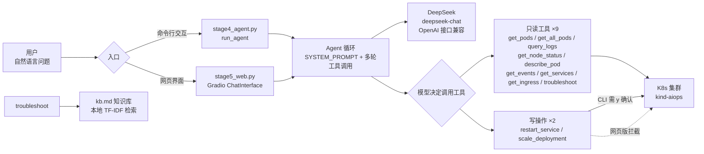

# 技术详解（TECHNICAL）

本文面向想了解实现细节的读者（复试老师 / 技术面试官 / 自己复盘）。
若只想快速上手，看 [`README.md`](../README.md) 即可。

---

## 1. 项目定位

把「自然语言 → K8s 运维操作」做成一个**可复用、可控、可测**的 Agent：

- 用户用中文提问（如“哪个 Pod 崩了？”“它为什么起不来？”）
- Agent **调用工具**去查真实集群数据，而不是凭模型记忆编造
- 诊断类问题自动聚合多源数据 + 知识库，输出带根因和修复建议的报告
- 写操作受安全层约束，避免误删误改

设计上坚持一条原则：**模型只“提议”调用哪个工具，真正执行的是确定性代码**。这样结果可预期、可测试、可审计。

---

## 2. 架构总览



**核心链路**：用户提问 → Agent 循环（SYSTEM_PROMPT 约束行为）→ 模型决策 → 调用工具获取实时数据 → 结果回喂模型 → 模型给出结论。

---

## 3. 核心设计

### 3.1 工具层：声明式封装 + 只读/写分组

每个运维能力用 LangChain `@tool` 装饰器封装成 `StructuredTool`，函数体就是
「调用 `kubernetes` 客户端 → 拉数据 → 格式化成中文文本」。

设计要点：

- **显式区分只读与写操作**：`get_*` 系列（9 个）和 `troubleshoot` 都是只读；
  `restart_service` / `scale_deployment` 标记为写操作，进入 `DANGEROUS_TOOLS` 白名单。
- **每个工具对应一条 `kubectl` 语义**（见 README 工具清单），降低模型“选错工具”的概率。
- **好处**：模型只负责“调哪个工具 + 给什么参数”，真正执行的是确定性 Python 代码，
  可控、可测、出错能定位。

### 3.2 Agent 循环：多轮工具调用闭环

这是“Agent”与普通“聊天机器人”的本质区别——**不是答一轮就停，而是能连着调多个工具直到凑出结论**。

```python
while ai_msg.tool_calls:                       # 模型本轮还要调工具
    for call in ai_msg.tool_calls:
        result = tool_map[call["name"]].invoke(call["args"])
        messages.append(ToolMessage(result, tool_call_id=call["id"]))
    ai_msg = llm_with_tools.invoke(messages)   # 结果回喂，模型再决策
# 跳出循环 → ai_msg.content 即为最终自然语言回答
```

`SYSTEM_PROMPT` 同时约束三点：

1. **必须调工具查真实数据**，禁止凭训练记忆编造；
2. **用中文回答**；
3. **不能修改任何资源配置**，只给修复建议和 `kubectl` 命令。

### 3.3 安全层：写操作受控

写操作的风险不在于“能不能做”，而在于“谁来决定做、做了能不能撤回”。设计如下：

| 形态 | 写操作处理 | 原因 |
|---|---|---|
| 网页版 | 直接拦截，返回提示引导走命令行 | 网页可能暴露在外，避免被他人误触集群 |
| 命令行版 | 执行前 `input("确认执行吗？(y/n)")` | 操作由本人发起，但仍需显式确认 |

外加 `SYSTEM_PROMPT` 约束模型“不能修改任何资源配置”，形成三层防护：
**模型只提议 → 代码执行 → 人工确认**，责任清晰分离。

### 3.4 RAG 诊断增强

`troubleshoot` 聚合三个数据源：

```
describe_pod（容器状态/重启次数/镜像/挂载）
+ get_events（命名空间事件，根因常在此）
+ query_logs（最近日志，含中文故障速查）
+ rag.retrieve(现象)（kb.md 知识库片段）
→ 三段式报告：①根因分析 ②修复建议 ③可选 kubectl 命令
```

**为什么用 TF-IDF 而不是深度学习 embedding？**

运行环境无法访问外网（HuggingFace / DockerHub 均不通），`bge-small-zh` 等中文
embedding 模型下载失败。改用 `scikit-learn` 的 `TfidfVectorizer`（**字符级 n-gram**）：

- 零外部依赖、离线可用、结果确定可靠；
- 中文技术术语（如 `CrashLoopBackOff`、`ImagePullBackOff`）用 char n-gram 无需分词即可良好匹配；
- 接口抽象为 `retrieve(query, top_k=3)`，日后若环境可联网，只需把 `KbRetriever`
  换成 `sentence-transformers` 的 `bge-small-zh`，**上层调用无需改动**。

**兜底**：`troubleshoot` 用延迟 import + `try-except`，向量库不可用时自动跳过，不影响其他工具。

### 3.5 双形态复用同一套核心

`stage4_agent.py`（CLI）与 `stage5_web.py`（Web）**共用同一套**
`tools` / `SYSTEM_PROMPT` / `llm_with_tools`，差异只在：

- 入口交互方式（终端 `input` vs Gradio `ChatInterface`）；
- 安全层执行策略（CLI 要 `y` 确认 vs Web 直接拦截）。

核心逻辑单点维护，避免两份实现漂移。

---

## 4. 踩过的坑（技术细节）

这些是从练习到成品过程中真实解决的问题，也是面试常被追问的点：

| 问题 | 根因 | 解法 |
|---|---|---|
| `StructuredTool` 直接 `()` 调用不执行 | LangChain 工具须用 `.invoke()` | 统一用 `.invoke({"arg": v})` 调用 |
| 日志显示 `b'...'` | `kubernetes` 客户端把 bytes 用 `str()` 包裹 | `ast.literal_eval` 还原真实字节 |
| 启动即 `APIConnectionError` | 残留代理 `HTTP_PROXY=127.0.0.1:7890` | 代码启动时 `os.environ.pop` 自动清理 |
| Gradio 自定义样式不生效 | Gradio 6.x 的 `css`/`js` 必须传给 `demo.launch()`，写在 `gr.Blocks(css=)` 只报警告 | 样式与脚本均传入 `launch()` |
| 思考时页面出现双滚动条 | 处理中 Gradio 插入空白“思考占位气泡”撑高页面 | `js` 注入 `MutationObserver` 隐藏空气泡，保留右下角计时 |
| CI 导入即失败 `Missing credentials` | `stage4_agent.py` 被 import 时实例化 `ChatOpenAI`，CI 无 Key | `ci.yml` 注入占位 `DEEPSEEK_API_KEY=sk-dummy-ci-only`（测试不真调 LLM） |
| 多异常 Pod 时重复拉事件 | `get_events` 在逐 Pod 循环内（它拉全量事件，不按 Pod 过滤） | 提到循环外，拉一次循环内复用（见 commit 优化） |

---

## 5. 测试策略

`tests/test_tools.py` 共 9 项**纯逻辑测试**，刻意做到：

- **不依赖真实集群**（用 mock / 纯函数验证）；
- **不消耗 API**（不实例化真实 LLM 调用）；
- **不要求联网**（RAG 用本地 TF-IDF）。

覆盖：RAG 检索命中、Pod 状态细粒度识别、`@tool` 清单完整性、写操作拦截逻辑、
`SYSTEM_PROMPT` 约束、代理清理等。可离线 `pytest` 运行，并由 GitHub Actions 在每次
push/PR 自动执行，保证“能跑”这件事被持续验证。

---

## 6. 模块职责

| 文件 | 职责 |
|---|---|
| `stage4_agent.py` | 工具定义 + 安全层 + 诊断闭环 + 命令行入口 |
| `stage5_web.py` | Gradio 网页界面（复用核心，拦截写操作） |
| `rag.py` | RAG 知识库检索（本地 TF-IDF） |
| `kb.md` | 知识库文本（10 个 K8s 排障主题） |
| `crash-test.yaml` | 演示用崩溃 Pod（etcd 镜像 + 错误启动参数制造 `CrashLoopBackOff`） |
| `tests/test_tools.py` | pytest 纯逻辑测试（9 项） |

---

## 7. 设计取舍小结

- **本地 kind 集群而非云上**：零成本、可随时重建，适合演练与演示。
- **TF-IDF 而非 embedding**：受限于离线环境，换取“确定可靠、零依赖”。
- **写操作白名单 + 双形态差异化策略**：安全与易用兼顾。
- **模型只提议、代码执行、人确认**：把“AI 的不确定性”关在可控边界内。
